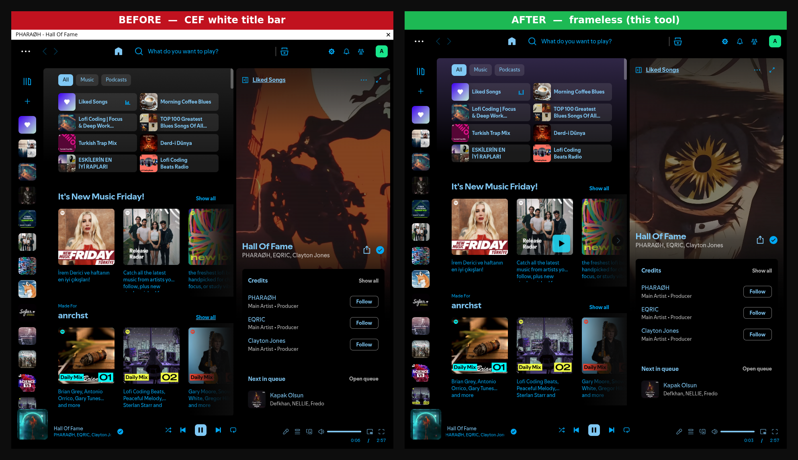

# spotify-cef-noframe

**Remove Spotify's ugly white "Spotify Premium" title bar on Wayland tiling
WMs (niri / Sway / Hyprland / river / …) — no Flatpak, no Snap, no patched
binary, no Spicetify.**

A ~40-line `LD_PRELOAD` shim that forces Spotify's CEF window to be
*frameless*, the way it was before the regression.

 <!-- optional: drop a screenshot here -->

---

## The problem

Recent Spotify desktop builds create their main window through Chromium
Embedded Framework's **Views** API. On a compositor that doesn't give the
client server-side decorations (which is every tiling Wayland WM), CEF draws
its own generic, **unthemed white title bar** showing `Spotify Premium` and a
lone close button — floating above Spotify's normal dark UI.

It appeared "after an update" for a lot of people and is widely reported
(Spotify Community, Arch forums, r/spotify, r/hyprland, …). Spotify has
acknowledged it; there is no upstream fix yet.

## Why the usual advice doesn't work

Every layer people normally reach for was ruled out **by inspection** (CEF
remote-debugging screenshot of the DOM, `nm`/`ldd` on the binary, runtime
delegate-size validation):

| Fix people suggest | Why it can't work here |
| --- | --- |
| Spicetify / custom CSS | The bar is **not in the xpui DOM** — proved via CDP screenshot |
| `gtk3-nocsd`, `GTK_CSD=0` | Main window is a **CEF Views window, not a GtkWindow** |
| `--ozone-platform=x11`, unset `WAYLAND_DISPLAY`, disable Ozone | Bar persists under **pure XWayland** too |
| GTK theme / `adw-gtk3-dark` | It's not GTK-themed chrome |
| Downgrade / flatpak / snap | Regression spans deb, snap **and** flatpak |

The bar is drawn by Spotify's bundled Chromium **browser process** itself.
Nothing in normal userland can reach it… except the CEF C API boundary.

## How this works

Spotify calls the **stable, exported** CEF C API:

```c
cef_window_t* cef_window_create_top_level(cef_window_delegate_t* delegate);
```

CEF draws the frame because the delegate's `is_frameless()` callback returns
false. This shim interposes that one exported symbol, flips two callbacks in
the delegate the app passes —

* `is_frameless()` → `1`
* `with_standard_window_buttons()` → `0`

— then forwards to the real libcef function. CEF then creates a **frameless**
window. Spotify already ships its own draggable region (`.body-drag-top`), so
everything (dragging, resizing, its own controls) keeps working.

No binary is modified. It's pure runtime interposition of a documented ABI,
trivially reversible, and survives Spotify updates **as long as the CEF major
version (struct layout) doesn't change**.

### Offsets

`cef_window_delegate_t` flattened layout (x86-64, 8-byte pointers):

```
cef_base_ref_counted_t        40   (size_t size + 4 fn ptrs)
CefViewDelegate   11 methods  +88
CefPanelDelegate   0 methods   +0
CefWindowDelegate: is_frameless = method #11 (10 before it)  +80
  => is_frameless                 @ 208
  => with_standard_window_buttons @ 216
```

Defaults target **CEF branch 7559 (chromium-144.0.7559)** — what Spotify
shipped at time of writing. The shim validates the delegate's self-reported
`size` at runtime before touching memory, so a layout mismatch fails *safe*
(no patch, no crash) rather than corrupting anything.

## Requirements

* A native Spotify install (AUR `spotify`, official `.deb`, `spotify-launcher`).
* A C compiler (`gcc`/`clang`), `bash`.
* x86-64. (Other arches: pointer size assumptions still hold at 8 bytes on
  64-bit; offsets are the same.)

## Install

```sh
git clone <your-repo-url> spotify-cef-noframe
cd spotify-cef-noframe
./install.sh
```

Then fully quit Spotify and relaunch it from your app launcher:

```sh
pkill -f spotify
```

That's it. `install.sh` builds `~/.local/lib/cef-noframe.so` and writes a
per-user `~/.local/share/applications/spotify.desktop` (derived from your
system one) that preloads it. The system install is left untouched.

## Uninstall

```sh
./uninstall.sh
```

## Launching from a terminal

The per-user `.desktop` only applies to launcher/menu launches. For a bare
terminal `spotify`, either:

```sh
LD_PRELOAD=~/.local/lib/cef-noframe.so spotify
```

or add an alias:

```sh
# bash/zsh
alias spotify='LD_PRELOAD=$HOME/.local/lib/cef-noframe.so spotify'
# fish
alias spotify 'env LD_PRELOAD=$HOME/.local/lib/cef-noframe.so spotify'
```

## Troubleshooting

Run with logging:

```sh
CEF_NOFRAME_DEBUG=1 LD_PRELOAD=~/.local/lib/cef-noframe.so spotify 2>&1 | grep cef-noframe
```

* `frameless forced (delegate size=312, …)` → working. `312` is the expected
  size for chromium-144.0.7559; a different number means a different CEF.
* `SKIP: delegate size=… < required …` → offsets don't match your CEF
  version. See below.

A/B test instantly without uninstalling: `CEF_NOFRAME_DISABLE=1`.

### Recomputing offsets for a new CEF version

If a Spotify update brings the bar back, the CEF major version likely changed
the delegate struct layout. You don't need to recompile to experiment —
override at runtime:

```sh
CEF_NOFRAME_DEBUG=1 CEF_NOFRAME_OFFSET=<n> CEF_NOFRAME_BTNS_OFFSET=<n+8> \
  LD_PRELOAD=~/.local/lib/cef-noframe.so spotify
```

To derive `<n>` precisely:

1. `strings /opt/spotify/libcef.so | grep -oE 'chromium-[0-9.]+'` → note the
   chromium build, e.g. `chromium-1XY.0.ABCD`.
2. The matching CEF git branch on
   <https://github.com/chromiumembedded/cef> is the **chromium build number**
   (`ABCD`).
3. From that branch read `include/views/cef_view_delegate.h` and
   `include/views/cef_window_delegate.h`. The generated C API keeps the
   **exact declaration order** of the virtual methods.
4. `offset(is_frameless) = 40 + (CefViewDelegate method count)*8
   + (CefPanelDelegate method count)*8 + (index of IsFrameless among
   CefWindowDelegate methods)*8`.
   (40 = `cef_base_ref_counted_t`; `CefPanelDelegate` has historically had 0
   methods.)
5. Put the number in `CEF_NOFRAME_OFFSET` (and `+8` in
   `CEF_NOFRAME_BTNS_OFFSET`), or edit the defaults in
   `src/cef_noframe.c` and re-run `./install.sh`.

PRs with a verified offset table per CEF version are very welcome.

## FAQ

**Is this safe?** It only ever writes two function pointers into a struct the
app itself allocated, and only after checking the struct's self-reported
size. Worst realistic case on a bad offset is Spotify not starting — remove
`LD_PRELOAD` and you're back to stock.

**Does it touch the Spotify binary?** No. Nothing on disk in the Spotify
install is modified.

**Flatpak/Snap?** `LD_PRELOAD` doesn't cross the Flatpak sandbox the same
way; this targets native installs (the whole point is avoiding Flatpak). Snap
may work if the snap can see the `.so` path — untested.

**Will updates break it?** Spotify app updates: fine. A CEF *major* bump:
recompute the offset (above). The runtime size-check makes a mismatch fail
safe, not crash.

## Credits

Diagnosed and built by **Alphawk**, with Claude (Anthropic) doing the deep
CEF/CDP spelunking. Born from one very stubborn white bar on
[niri](https://github.com/YaLTeR/niri).

If this saved your sanity, share it with the next person rage-googling
"spotify white title bar wayland".

## License

MIT — see [LICENSE](LICENSE).
